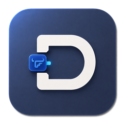

# DockFN

<p align="center">
  
</p>

DockFN 将本机已有的 HTTP/HTTPS 服务登记为 fnOS 应用入口。DockFN 管理入口壳，目标服务及其容器、存储和业务数据仍由原有环境管理。

## 功能

- 发现宿主机和 Docker Web 服务，读取 WatchCow 建议并匹配已有 fnOS 入口。
- 创建、更新、修复、回退、移除和更新图标等 fnOS 登记壳操作。
- 支持 URL、iframe 和自动或自定义应用图标。
- 提供全局 fnID 模板、新增应用默认值和 DockFN 图标角标配置。
- 提供安装诊断、脱敏日志和诊断清理。
- 卸载 DockFN 时默认保留已创建的入口。

## 适用场景

DockFN 适合已经在 fnOS 主机固定端口提供访问、只需要补充桌面入口的 Web 服务：

- 自行部署并发布宿主机端口的 Docker 服务，无需由 DockFN 启停或接管容器。
- 通过宝塔、1Panel 等第三方面板安装的 Web 服务。
- 已通过 Nginx、Caddy 等反向代理到本机固定端口的局域网 Web 服务。
- 直接安装在物理机上的管理后台、开发工具或其他 Web 服务。
- 使用 `network_mode: host`、由宿主机端口直接提供访问的 Docker 服务。
- 已配置 WatchCow 标签的服务，可复用标签信息并匹配已有 fnOS 入口，避免重复创建。
- 同一套服务提供多个独立 Web 入口时，可按端口和路径分别创建应用壳。

## 使用边界

- 正式部署方式为 fnOS 原生 FPK，支持 x86_64 和 ARM64 构建。
- 安装向导会主动配置后续入口壳的存储分区（例如填写 `1` 表示 `/vol1`）；不存在的分区编号会回退到 `/vol1`。该位置在安装后固定，不会自动迁移，也不会改变目标服务的数据位置。
- 一个 DockFN 应用对应一个固定宿主机端口和一个 fnOS 桌面入口。
- 服务发现不在后台运行；默认在进入“新增应用”流程时扫描，也可在全局配置中关闭自动扫描。发现结果不会自动创建应用。
- DockFN 不提供反向代理、中继、公共 URL、DNS、证书或 Docker 生命周期管理。
- appname 和桌面入口使用全局模板生成的完整 fnOS ID；FN Connect 域名、DNS 和证书由 fnOS 生成和管理。

## 安装

从 GitHub Release 下载与设备架构对应的文件，然后在 fnOS 应用中心手工安装：

```text
dockfn-<version>-x86_64.fpk
dockfn-<version>-arm64.fpk
```

首次打开需要使用 fnOS 管理员账户。目标 Web 服务必须已经通过固定宿主机端口提供访问。

## 基本流程

1. 打开“新增应用”，等待自动扫描或选择手动填写。
2. 核对入口信息。
3. 确认创建后进入执行页，等待 fnOS 应用中心完成安装和入口校验；成功后可关闭或继续创建。

首页“配置”可设置完整 fnOS ID 模板、默认打开方式、默认用户范围、是否自动扫描和应用入口是否显示 DockFN 角标。默认模板为 `dkfn.{id}`，也可使用 `{id}.dkfn` 等形式；模板必须包含一个 `{id}` 和至少一个固定标识，DockFN 不再自动追加后缀。新增表单会把中文名称转换为无声调拼音、将英文转为小写并过滤特殊符号，生成可编辑的应用 ID，再代入模板。修改模板不会重命名现有应用；角标配置在新建或重新保存入口时生效。

## 构建与验证

标准 Make 流程需要 Go 1.26、Node.js 24、npm、GNU Make 和 POSIX shell：

```sh
make verify
make fpk
```

`make verify` 执行格式检查、静态检查、依赖审计、前后端测试和竞态测试。`make fpk` 默认读取根目录 [VERSION](VERSION) 中的版本号，执行前端构建、双架构交叉编译、FPK 构建、校验和及产物检查；需要复现其他版本时仍可用 `VERSION=x.y.z` 覆盖。构建输出位于：

```text
dist/fpk/dockfn-<version>-x86_64.fpk
dist/fpk/dockfn-<version>-arm64.fpk
dist/SHA256SUMS
```

Windows 用户可双击 `scripts/build-fpk.cmd` 一键打包，或在 PowerShell 执行 `./scripts/build-fpk.ps1`。脚本读取 [VERSION](VERSION)，自动执行前端构建、Windows 辅助程序编译、Linux x86_64/arm64 交叉编译、FPK 打包、校验和生成和产物检查；需要覆盖版本时可执行 `./scripts/build-fpk.ps1 -Version <version>`。该入口需要 Go 1.26、Node.js 24、npm，以及 Git Bash 或 WSL 提供的 `bash`。输出目录固定为 `dist/fpk`；如该目录不可写，请先关闭占用它的进程或修复目录权限。

构建入口分工如下：

- `make verify`：只执行完整自动化测试和静态检查，不生成 FPK。
- `make fpk`：执行标准 FPK 构建、校验和及产物检查。
- `scripts/build-fpk.sh`：底层 POSIX 打包脚本，供 Make、CI 和 Windows 入口复用。
- `scripts/build-fpk.ps1` / `scripts/build-fpk.cmd`：Windows PowerShell 与双击一键打包入口，不要求安装 GNU Make；完整测试仍需单独执行 `make verify` 或对应的测试命令。

## 本地开发

本地 TCP 模式仅用于开发，且只允许监听回环地址：

```powershell
$env:DOCKFN_DATA_DIR = "$PWD\.local-data"
$env:DOCKFN_DEV_LISTEN = "127.0.0.1:32100"
$env:DOCKFN_DEV_ADMIN = "1"
go run ./cmd/dockfn server
```

没有 fnOS 权限助手时，本地开发模式会明确报告服务发现不可用，不返回模拟数据。

## 兼容性

x86_64 FPK 已在真实 fnOS 设备完成安装和核心功能验证。ARM64 FPK 已通过 CI 交叉编译和静态产物校验；本版本尚未覆盖 ARM64 真机安装验证，使用前请在对应设备上单独确认。

## 文档

- [架构](docs/architecture.md)
- [运维](docs/operations.md)
- [安全模型](docs/security.md)
- [OpenAPI](api/openapi.yaml)
- [架构决策](docs/adr/README.md)
- [发布流程](docs/release.md)
- [0.1.0 发布说明](docs/releases/v0.1.0.md)
- [0.1.1 发布说明](docs/releases/v0.1.1.md)

## 许可证

[Apache License 2.0](LICENSE)。第三方组件及其许可证见 [THIRD_PARTY_NOTICES.md](THIRD_PARTY_NOTICES.md)。
